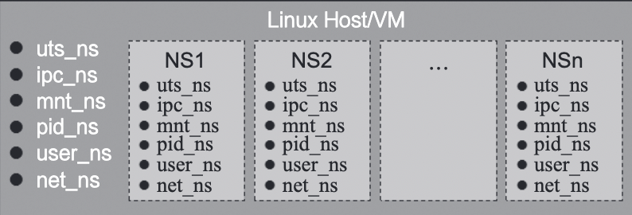
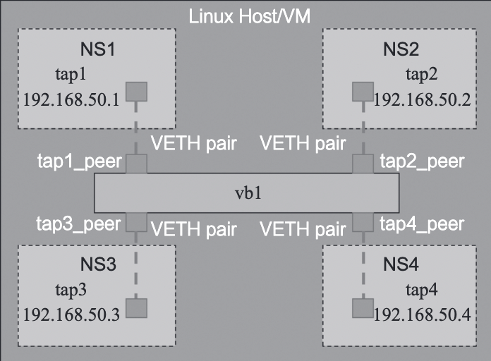
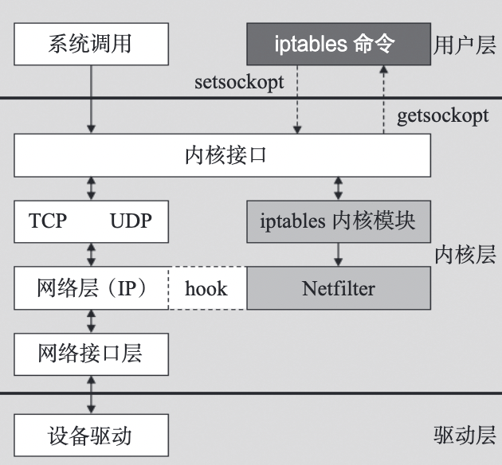
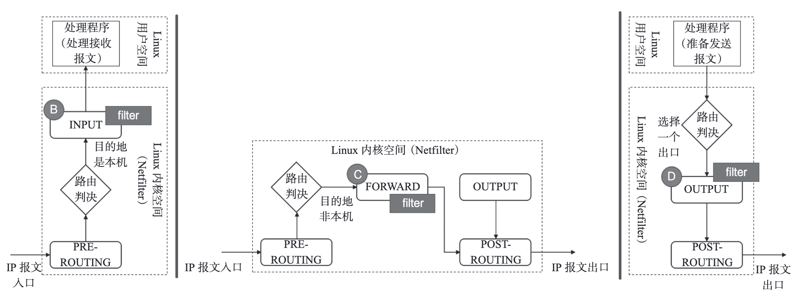
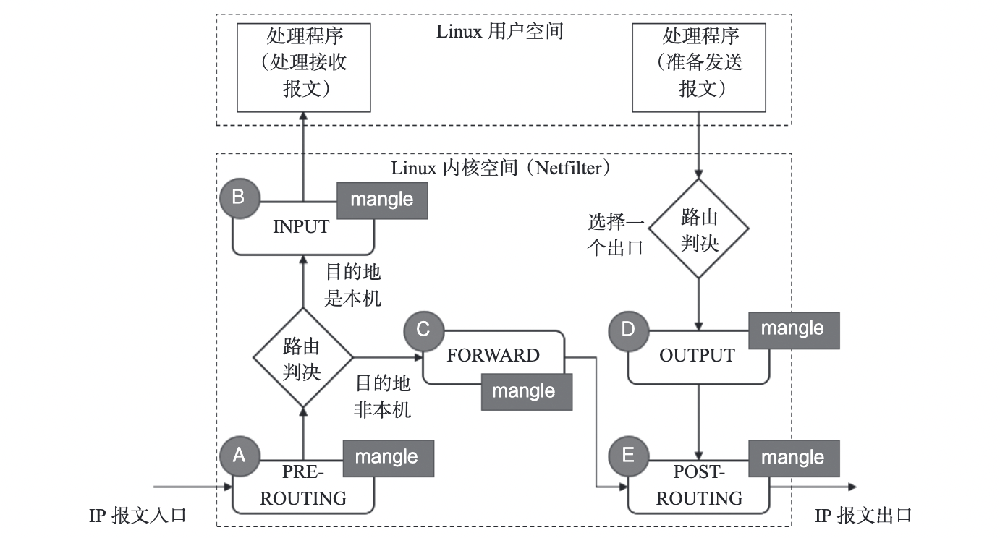
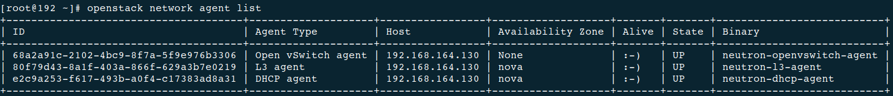
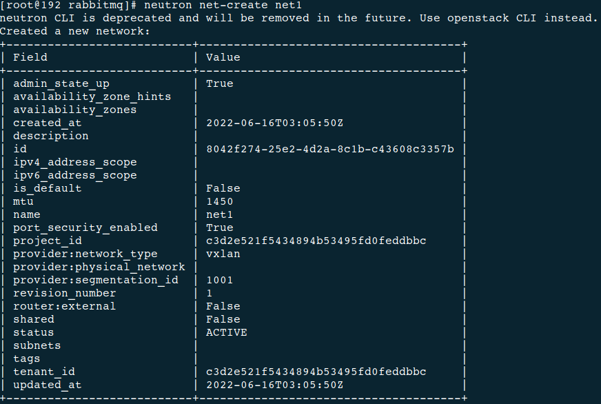
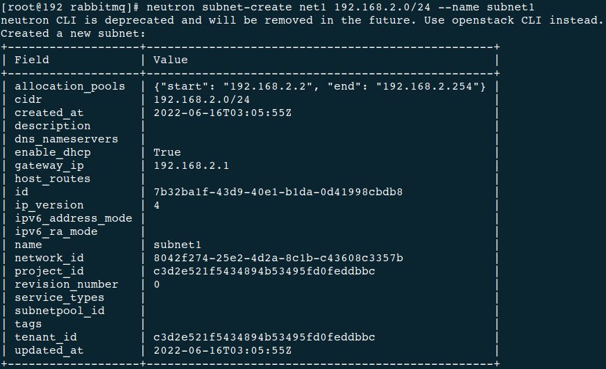
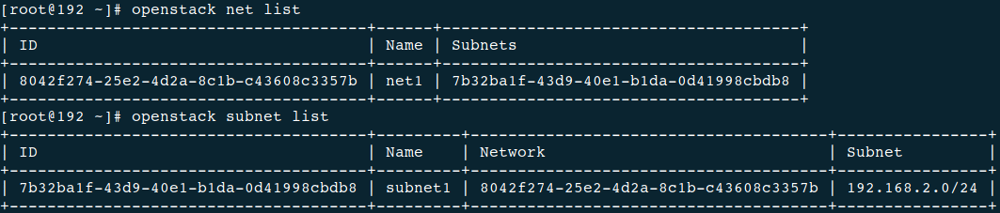

# 麒麟软件实训报告

## 1 Linux 虚拟网络基础

### 1.1 tap

tap 和 tun 是操作系统内核中的虚拟网络设备，tap 位于二层，tun 位于三层。它们的数据结构如下：

```c
struct tun_struct {
    char name[8];                // 设备名
    unsigned long flags;         // 区分tun和tap设备
    struct fasync_struct *fasync; // 文件异步通知结构
    wait_queue_head_t read_wait; // 等待队列
	struct net_device dev;       // Linux抽象网络设备结构
    struct sk_buff_head txq;     // 网络缓冲区队列
    struct net_device_stats stats; // 网卡状态信息结构
};
```

tap 和 tun 的数据结构定义相同，两者仅通过一个 Flag 来区分。但二者承载的功能区别很大：

- tap 位于网络 OSI 模型的二层（数据链路层）
- tun 位于网络的三层

tap 从功能定位上来讲，位于数据链路层，数据链路层的主要协议有：

1. 点对点协议（Point-to-Point Protocol）
2. 以太网（Ethernet）
3. 高级数据链路协议（High-Level Data Link Protocol）
4. 帧中继（Frame Relay）
5. 异步传输模式（Asynchronous Transfer Mode）

tap 只与其中一种协议——以太网（Ethernet）协议对应。所以 tap 有时也称为“虚拟以太设备”。

创建 tap 的方法：

1. Linux 使用 tun 模块实现了 tun/tap，所以首先 Linux 得有 tun 模块，使用 `modinfo tun` 检查
2. 使用 `lsmod | grep tuntun` 检查 tun 模块是否已经加载
3. 确认 Linux 是否有操作 tun/tap 的命令行工具 tunctl，安装方式 `yum install tunctl`
4. 创建一个 tap 设备：`tunctl -t tap_test`
5. 查看刚刚创建的 tap：`ip link list` 或 `ifconfig -a`
6. 绑定IP地址：`ip addr add local 192.168.100.1/24 dev tap_test` 或 `ifconfig tap_test 192.168.100.1/24`
7. 创建完成

### 1.2 namespace

传统的 Linux 的许多资源是全局的，namespace 的目的首先就是将这些资源做资源隔离。Linux 可以在一个 Host 内创建许多 namespace，不同 namespace 的资源互相不可见、彼此透明。namespace 示意图如下所示：



从网络的视角来看，一个 namespace 提供了一份独立的网络协议栈（网络设备接口、IPv4、IPv6、IP路由、防火墙规则、sockets 等）。一个设备（Linux Device）只能位于一个 namespace 中，不同 namespace 中的设备可以利用 veth  pair 进行桥接。

namespace 操作：

1. 查看当前的 namespace 列表：`ip netns list`
2. 创建一个 namespace，名字是 ns_test：`ip netns add ns_test`
3. 把原来创建的虚拟设备 tap_test 迁移到这个 namespace 里去：`ip link set tap_test netns ns_test`
4. 查看或操作 namespace 里面的设备：`ip [-all] netns exec [NAME] cmd ...`

### 1.3 veth pair

veth  pair 不是一个设备，而是一对设备，以连接两个虚拟以太端口。操作 veth  pair，需要跟 namespace 一起配合，否则没有意义。

veth pair 简单示例：


创建简单示例：

1. 创建 veth pair：`ip link add tap1 type veth peer name tap2`
2. 创建 namespace：`ip netns add ns1ip netns add ns2`
3. 把两个 tap 分别迁移到对应的 namespace 中：`ip link set tap1 netns ns1ip link set tap2 netns ns2`
4. 分别给两个 tap 绑定 IP 地址：`ip netns exec ns1 ip addr add local 192.168.50.1/24 dev tap1`、`ip netns exec ns2 ip addr add local 192.168.50.2/24 dev tap2`
5. 将两个 tap 设置为 up：`ip netns exec ns1 ifconfig tap1 up`、`ip netns exec ns2 ifconfig tap2 up`
6. ping：`ip netns exec ns2 ping 192.168.50.1`、`ip netns exec ns1 ping 192.168.50.2`

### 1.4 Bridge

Linux 中 Bridge（网桥）即为 Switch（交换机）。Linux 实现 Bridge 功能的是 brctl 模块，相关用法如下：

```sh
brctlUsage: brctl [commands]
commands:
	addbr         <bridge>              add bridge
    delbr         <bridge>              delete bridge
    addif         <bridge> <device>     add interface to bridge
    delif         <bridge> <device>     delete interface from bridge
    hairpin       <bridge> <port> {on|off}     turn hairpin on/off
    setageing     <bridge> <time>              set ageing time
    setbridgeprio <bridge> <prio>              set bridge priority
    setfd         <bridge> <time>              set bridge forward delay
    sethello      <bridge> <time>              set hello time
    setmaxage     <bridge> <time>              set max message age
    setpathcost   <bridge> <port> <cost>       set path cost
    setportprio   <bridge> <port> <prio>       set port priority
    show          [ <bridge> ]          show a list of bridges
    showmacs      <bridge>              show a list of mac addrs
    showstp       <bridge>              show bridge stp info
    stp           <bridge> {on|off}     turn stp on/off
```

veth pair 综合示例：



实现这个用例：

1. 创建 veth pair：`ip link add tap1 type veth peer name tap1_peer`、`ip link add tap2 type veth peer name tap2_peer`、`ip link add tap3 type veth peer name tap3_peer`、`ip link add tap4 type veth peer name tap4_peer`
2. 创建 namespace：`ip netns add ns1`、`ip netns add ns2`、`ip netns add ns3`、`ip netns add ns4`
3. 把 tap 迁移到相应 namespace 中：`ip link set tap1 netns ns1`、`ip link set tap2 netns ns2`、`ip link set tap3 netns ns3`、`ip link set tap4 netns ns4`
4. 创建 Bridge：`brctl addbr br1`
5. 把相应 tap 添加到 Bridge 中：`brctl addif br1 tap1_peer`、`brctl addif br1 tap2_peer`、`brctl addif br1 tap3_peer`、`brctl addif br1 tap4_peer`
6. 配置相应 tap 的 IP 地址：`ip netns exec ns1 ip addr add local 192.168.50.1/24 dev tap1`、`ip netns exec ns2 ip addr add local 192.168.50.2/24 dev tap2`、`ip netns exec ns3 ip addr add local 192.168.50.3/24 dev tap3`、`ip netns exec ns4 ip addr add local 192.168.50.4/24 dev tap4`
7. 将 Bridge 及所有 tap 状态设置为 up：`ip link set br1 up`、`ip link set tap1_peer up`、`ip link set tap2_peer up`

### 1.5 Router

Linux 就是路由器（Router），修改配置文件 “/etc/sysctl.conf”， 将 `net.ipv4.ip_forward = 0` 修改为 `1`，保存后退出，即打开了路由转发功能。

查看路由表：`route -nee`，添加静态路由：`route add -net [ip] netmask [netmask] gw [gateway]`。

### 1.6 tun

tun 是一个网络层（IP）的点对点设备，它启用了 IP 层隧道功能。Linux 原生支持的三层隧道，可以通过命令行 `ip tunnel help` 查看：

```sh
ip tunnel help
Usage: ip tunnel { add | change | del | show | prl | 6rd } [ NAME ]
	[ mode { ipip | gre | sit | isatap | vti } ] [ remote ADDR ] [ local ADDR ]
    [ [i|o]seq ] [ [i|o]key KEY ] [ [i|o]csum ]
    [ prl-default ADDR ] [ prl-nodefault ADDR ] [ prl-delete ADDR ]
    [ 6rd-prefix ADDR ] [ 6rd-relay_prefix ADDR ] [ 6rd-reset ]
    [ ttl TTL ] [ tos TOS ] [ [no]pmtudisc ] [ dev PHYS_DEV ]
Where: NAME := STRING
	ADDR := { IP_ADDRESS | any }
    TOS  := { STRING | 00..ff | inherit | inherit/STRING | inherit/00..ff }
    TTL  := { 1..255 | inherit }
    KEY  := { DOTTED_QUAD | NUMBER }
```

可以看到，Linux 一共原生支持 5 种三层隧道（tunnel）：

| 隧道   | 简述                                                         |
| ------ | ------------------------------------------------------------ |
| ipip   | IP in IP，在 IPv4 报文的基础上再封装一个 IPv4 报文头，属于IPv4 in IPv4 |
| gre    | 通用路由封装（Generic Routing Encapsulation），定义了在任意一种网络层协议上封装任意一个其他网络层协议的协议，属于 IPv4/IPv6 over IPv4 |
| sit    | 这个跟 ipip 类似，只不过是用一个 IPv4 的报文头封装 IPv6 的报文，属于 IPv6 over IPv4 |
| isatap | 站内自动隧道寻址协议，一般用于 IPv4 网络中的 IPv6/IPv4 节点间的通信 |
| vti    | 全称是 Virtual Tunnel Interface，为 IPsec 隧道提供了一个可路由的接口类型 |

### 1.7 iptables

通过 iptables 相关的命令行，可以实现了防火墙、NAT 的功能，而这种功能的实现是通过运行在内核空间的 netfilter 模块完成的，它们之间的关系如下所示：



iptables 内置了三张表：filter、nat 和 mangle。filter 和 nat 是为了实现防火墙和 NAT 功能而服务的，mangle 主要应用在修改数据包内容上，用来做流量整形。iptables 还内置了另外 2 张表 raw 和 security，这里不详细介绍了。

iptables 内置的既是三张表，也是三条链（chain），也是三种策略（policy），这些策略由不同规则（rule）串接而成。

`iptables -A INPUT -i eth0 -p icmp -j ACCEPT` 这条规则表达的意思是：允许所有从eth0 端口进入且协议是 ICMP 的报文可以接受（可以进入下一个流程）的。

#### 1.7.1 NAT

NAT（Network Address Translation，网络地址转换），顾名思义，就是从一个 IP 地址转换为另一个 IP 地址。当然，这里面的根本原因还是IP地址不够用的问题（解决 IP 地址枯竭的方法一个是 IPv6，另一个就是 NAT）。

NAT 从实现技术角度分为：静态 NAT、动态 NAT 和端口多路复用三种方案：

1. 静态 NAT（Static NAT）

	静态 NAT 有两个特征：

	1. 私网IP地址与公网IP地址的转换规则是静态指定的，比如 10.10.10.1 与 50.0.0.1 互相转换，这个是静态指定好的；
	2. 私网 IP 地址与公网 IP 地址是 1∶1，即一个私网 IP 地址对应 1 个公网 IP 地址。

2. 动态 NAT

	一般情况是公网 IP 比私网 IP 地址少的时候，用到动态 NAT 方案。动态 NAT，就是一批私网 IP 与公网 IP 地址之间不是固定的转换关系，而是在 IP 报文处理过程中由 NAT 模块进行动态匹配。虽然，公网 IP 比私网 IP 地址少，但是，同时在线的私网 IP 需求小于等于公网 IP 数量，不然某些私网 IP 将得不到正确的转换，从而导致网络通信失败。

	动态 NAT，有三个特征：

	1. 私网与公网IP地址之间不是固定匹配转换的，而是变化的；
	2. 两者之间的转换规则不是静态指定的，而是动态匹配的；
	3. 私网 IP 地址与公网 IP 地址之间是 m∶n，一般 m < n。

3. 端口多路复用 / PAT

	如果私网 IP 地址有多个，而公网 IP 地址只有一个，那么，静态 NAT 显然是不行了，动态 NAT 也基本不行（只有一个公网 IP，不够用）。此时，就需要用到端口多路复用。多个私网 IP 映射到同一个公网 IP，不同的私网 IP 利用端口号进行区分，这里的端口号指的是 TCP/UDP 端口号。所以端口复用又叫 PAT（Port Address Translation）。

	端口多路复用（PAT）的特征是：

	1. 私网 IP：公网 IP = m∶1；
	2. 以公网 IP + 端口号来区分私网 IP。

4. SNAT / DNAT

	前面说的静态 NAT（Static NAT）和动态 NAT不能简称 SNAT、DNAT，因为 SNAT/DNAT 有另外的含义，是另外的缩写。要区分SNAT（Source Network Address Translation，源地址转换）与DNAT（Destination Network Address Translation，目的地址转换）这两个功能可以简单地由连接发起者是谁来区分。

	1. 内部地址要访问公网上的服务时（如 Web访问），内部地址会主动发起连接，由路由器或者防火墙上的网关对内部地址做个地址转换，将内部地址的私有 IP 转换为公网的公有 IP，网关的这个地址转换称为 SNAT，主要用于内部共享 IP 访问外部。
	2. 当内部需要提供对外服务时（如对外发布 Web 网站），外部地址发起主动连接，由路由器或者防火墙上的网关接收这个连接，然后将连接转换到内部，此过程是由带有公网 IP 的网关替代内部服务来接收外部的连接，然后在内部做地址转换，此转换称为 DNAT，主要用于内部服务对外发布。

Linux 内核空间 Netfilter 模块的 NAT 处理，一共有三个 Chain（处理时刻点）：

| 流   | 流描述                                 | Chain       | NAT类型 | NAT说明                                                      |
| ---- | -------------------------------------- | ----------- | ------- | ------------------------------------------------------------ |
| 流1  | 流从外部到达 Linux 用户空间（私网 IP） | PREROUTING  | DNAT    | 将目的 IP 从公网 IP（Linux 内核空间对应的 IP）转换到私网 IP（Linux 用户空间对应的 IP） |
| 流2  | 流从 Linux 用户空间（私网 IP）到达外部 | POSTROUTING | SNAT    | 将源 IP 从私网 IP（Linux 用户空间对应的 IP）转换到公网 IP（Linux 内核空间对应的 IP） |
| 流3  | 流从 Linux 内核空间（公网 IP）到达外部 | OUTPUT      | DNAT    |                                                              |

#### 1.7.2 Firewall

iptables 中的 Firewall（防火墙）概念，属于网络防火墙的概念。iptables 中的防火墙的规则就是基于 TCP/IP 协议栈的规则，所以我们称之为网络防火墙。这些规则有：

1. in-interface（入网络接口名），数据包从哪个网络接口进入；
2. out-interface（出网络接口名），数据包从哪个网络接口输出；
3. protocol（协议类型），数据包的协议，如 TCP、UDP 和 ICMP 等；
4. source（源地址（或子网）），数据包的源IP地址（或子网）；
5. destination（目标地址（或子网）），数据包的目标IP地址（或子网）；
6. sport（源端口号），数据包的源端口号；
7. dport（目的端口号），数据包的目的端口号。

符合这些规则的，可以设置为通过（ACCEPT），反之，则不通过（DROP）。或者，符合这些规则的，设置为不通过（DROP）；反之，则通过（ACCEPT）。

Netfilter 中的 Firewall，会在三个时刻点，进行处理，如下图所示：



#### 1.7.3 mangle

mangle 表主要用于修改数据包的 ToS（Type  of  Service，服务类型）、TTL（Time  to  Live，生存周期）以及为数据包设置 Mark 标记，以实现 QoS（Quality  of  Service，服务质量）调整以及策略路由等应用。

netfilter 模块中的 mangle 处理的时刻点如下图所示：



### 1.8 Linux 虚拟网络基础总结

tap、tun、veth  pair 在 Linux 中都被称为设备，但是在与日常概念的类比中，常常被称作接口。Neutron 利用这些“接口”进行 Bridge 之间的连接、Bridge 与 VM（虚拟机）的连接、Bridge 与 Router之间的连接。三者与物理网卡之间的对比关系，如下图所示：


Router、Bridge 这些在 Linux 中没有被称为设备的网络功能，反而在日常概念中常常被称为设备。Bridge 提供二层转发功能，Router 提供三层转发功能。Router 还常常借助 iptable 提供 SNAT/DNAT 功能。Bridge 也常常借助 iptable 提供 Firewall 功能。

在 Neutron中，隔离是一个非常重要的特性，利用 namespace 做隔离也是 Neutron 的一个非常重要的手段。

## 2 Neutron 原理介绍

### 2.1 Neutron 概述

Neutron 是 OpenStack 项目中负责提供网络服务的组件，它基于软件定义网络的思想，实现了网络虚拟化下的资源管理。Neutron 的设计目标是实现“网络即服务”，为了达到这一目标，在设计上遵循了基于“软件定义网络”实现网络虚拟化的原则，在实现上充分利用了 Linux 系统上的各种网络相关的技术。

Neutron管理下面的实体：

- 网络：隔离的 L2 域，可以是虚拟、逻辑或交换。
- 子网：隔离的 L3 域，IP 地址块。其中每个机器有一个 IP，同一个子网的主机彼此 L3 可见。
- 端口：网络上虚拟、逻辑或交换端口。
	所有这些实体都是虚拟的，拥有自动生成的唯一标示id，支持CRUD功能，并在数据库中跟踪记录状态。

### 2.2 实现模式

无论哪种具体的网络虚拟化实现，一个简化和抽象后的系统架构可以表述为下图所示。


在启用 DVR 特性（J 版本以后支持）之前，所有流量（东西向、南北向）都需要经过网络节点的转发；DVR 特性则允许东西向流量和带有 Floating IP 的南北向流量不经过网络节点的转发，直接从计算节点的外部网络出去。

网络节点有且仅有 Neutron 服务，就是网络服务。Neutron 主要负责管理私有网段和公有网段之间的通信，同时管理虚拟机网络之间的通信以及防火墙等等。一般在部署时会部署两个以上的网络端口，分别用于与控制节点通信、同计算/存储节点通信、用于外部的虚拟机与相应的网络之间的通信。

计算节点主要包含计算服务、网络服务以及监控服务。计算节点对所部署的虚拟机提供基本的网络功能支持，包括隔离不同租户的虚拟机和进行一些基本的安全策略管理。计算节点包含 Nova，Neutron，Telemeter 三个服务：

- 基础服务 Nova：提供虚拟机的创建，运行，迁移，快照等各种围绕虚拟机的服务，并提供 API 与控制节点对接，由控制节点下发任务
- 基础服务 Neutron：提供计算节点与网络节点之间的通信服务
- 扩展服务 Telmeter：提供计算节点的监控代理，将虚拟机的情况反馈给控制节点，是 Centimeter 的代理服务

#### 2.2.1 GRE 模式

在 OpenStack 中网络实现的一个简化的架构示意：


计算节点上包括两台虚拟机 VM1 和 VM2，分别经过一个网桥（如 qbr-XXX）连接到 br-int 网桥上。br-int 网桥再经过 br-tun 网桥（物理网络是 GRE 实现）连接到物理主机外部网络。对于物理网络通过 vlan 来隔离的情况，则一般会存在一个 br-eth 网桥，替代 br-tun 网桥。

br-tun将带有 vlan tag 的 vm 跟外部通信的流量转换到对应的 gre 隧道，这上面要实现主要的转换逻辑，规则要复杂，一般通过多张表来实现，这些规则所组成的整体转发逻辑如下图所示。


计算节点上发往 GRE 隧道的网包最终抵达网络节点上的 br-tun，该网桥的规则跟计算节点上 br-tun 的规则相似，完成 tunnel 跟 vlan 之间的转换。br-int 上挂载了很多进程来提供网络服务，包括路由器、DHCP服务器等。这些进程不同的租户可能都需要，彼此的地址空间可能冲突，也可能跟物理网络的地址空间冲突，因此都运行在独立的网络名字空间中。规则跟计算节点的br-int规则一致，表现为一个正常交换机。

#### 2.2.2 VLAN 模式

Vlan 模式下的系统架构跟 GRE 模式下类似，如下图所示。


需要注意的是，在 vlan 模式下，vlan tag 的转换需要在 br-int 和 br-ethx 两个网桥上进行相互配合。即 br-int 负责从 int-br-ethX 过来的包（带外部 vlan）转换为内部 vlan，而 br-ethx 负责从 phy-br-ethx 过来的包（带内部 vlan）转化为外部的 vlan。

在计算节点中，类似 GRE 模式下，br-int 负责租户隔离，br-eth1 负责跟计算节点外的网络通信。在 Vlan 模式下，租户的流量隔离是通过 vlan 来进行的，因此此时包括两种 vlan，虚拟机在计算内流量带有的 local vlan 和在计算之外物理网络上隔离不同租户的 vlan。br-int 和 br-eth1 分别对从端口 int-br-eth1 和 phy-br-eth1 上到达的网包进行 vlan tag 的处理。此处有两个网，分别带有两个 vlan tag（内部 tag1 对应外部 tag101，内部 tag2 对应外部 tag102 ）。其中，安全组策略仍然在 qbr 相关的 iptables 上实现。

在网络节点中，类似 GRE 模式下，br-eth1 收到到达的网包，int-br-eth1 和 phy-br-eth1 上分别进行 vlan 转换，保证到达 br-int 上的网包都是带有内部 vlan tag，到达 br-eth1 上的都是带有外部 vlan tag。br-ex 则完成到 OpenStack 以外网络的连接。

#### 2.2.3 VXLAN 模式

VXLAN 模式下，网络的架构跟 GRE 模式类似，所不同的是，不同节点之间通过 VXLAN 隧道互通，即虚拟化层是采用的 VXLAN 协议，基本结构如下图所示。


计算节点主要包括两个网桥：集成网桥 br-int 和 隧道网桥 br-tun，网络节点担负着进行网络服务的任务，包括DHCP、路由和高级网络服务等，一般包括三个网桥：br-tun、br-int 和 br-ex。

### 2.3 使用的服务

1. 网络命名空间

	在 Linux 中，网络名字空间可以被认为是隔离的拥有单独网络栈（网卡、路由转发表、iptables）的环境。网络名字空间经常用来隔离网络设备和服务，只有拥有同样网络名字空间的设备，才能看到彼此。

2. DHCP 服务

	dhcp 服务是通过 dnsmasq 进程（轻量级服务器，可以提供 dns、dhcp、tftp 等服务）来实现的，该进程绑定到 dhcp 名字空间中的 br-int 的接口上。可以查看相关的进程。

3. 路由服务

	router 是提供跨 subnet 的互联功能的。比如用户的内部网络中主机想要访问外部互联网的地址，就需要 router 来转发（因此，所有跟外部网络的流量都必须经过 router）。目前router 的实现是通过 iptables 进行的。

4. 安全组

	安全组通过 Linux IPtables 来实现，为此，在计算节点上引入了 qbr* 这样的 Linux 传统 bridge（iptables 规则目前无法加载到直接挂在到 ovs 的 tap 设备上），整体逻辑如下图所示：

	

5. 负载均衡即服务

	负载均衡即服务（Load Balance as a Service，LBaaS）是一项网络高级服务。它允许租户动态的在自己的网络创建一个负载均衡设备，可以说是分布式系统中比较基础的组件，它接收前端过来的请求，然后将请求按照某种均衡的策略转发给后端资源池中的某个处理单元，以完成处理。进而可以实现高可用性和横向的扩展性。OpenStack Neutron 通过高级服务扩展的形式支持 LBaaS，目前默认是通过 HAProxy 软件来实现的。

6. 防火墙即服务

	防火墙即服务（FireWall as a Service）在网络节点上（具体说来是在路由器命名空间中）来实现。目前，OpenStack 中实现防火墙基于 Linux 系统自带的 iptables 实现。一个可能混淆的概念是安全组（Security Group），安全组的对象是虚拟网卡，由 L2 Agent 来实现，比如 neutron_openvswitch_agent 和 neutron_linuxbridge_agent，会在计算节点上通过配置 iptables 规则来限制虚拟网卡的进出访问。防火墙可以在安全组之前隔离外部过来的恶意流量，但是对于同个子网内部不同虚拟网卡间的通讯不能过滤（除非它要跨子网）。可以同时部署防火墙和安全组实现双重防护。

7. 分布式路由

	为了降低网络节点的负载，同时提高可扩展性，OpenStack 自 Juno 版本开始正式引入了分布式路由（Distributed Virtual Router，DVR）特性（用户可以选择使用与否），来让计算节点自己来处理原先的大量东西向流量和非 SNAT 南北流量（有 floating IP 的 vm 跟外面的通信）。这样网络节点只需要处理占到一部分的 SNAT （无 floating IP 的 vm 跟外面的通信）流量，大大降低了负载和整个系统对网络节点的依赖。很自然的，FWaaS 也可以跟着放到计算节点上。DHCP 服务、VPN 服务目前仍然需要集中在网络节点上进行。

## 3 虚拟网络安装配置

### 3.1 部署前的准备

挂载本地镜像源，安装以下 rpm 包：`python3-openstackclient`、`mariadb`、`mariadb-server`、`python3-PyMySQL`、`rabbitmq-server`、`memcached`、`python3-memcached`、`openstack-keystone`、`httpd`、`python3-mod_wsgi`、`openstack-neutron`、`openstack-neutron-ml2`、`openstack-neutron-openvswitch`、`ebtables`、`ipset`。

### 3.2 Neutron 的脚本部署

1. 定义 IP 和主机名变量，后续部署使用

	```sh
	LOCALMANAGEMENTIP="192.168.230.134"
	LOCALOVERLAYIP="192.168.230.134"
	LOCALHOSTNAME="localhost.localdomain"
	```

2. 设置语言为中文、编码为 `UTF-8`

	```sh
	localectl set-locale LANG=zh_CN.UTF-8

3. 利用 `firewalld` 开放端口，更新防火墙规则

	```sh
	firewall-cmd --permanent --add-port 9696/tcp #neutron
	firewall-cmd --permanent --add-port 5000/tcp #keystone
	firewall-cmd --permanent --add-port 5672/tcp #rabbitmq
	firewall-cmd --permanent --add-port 4789/udp #vxlan
	firewall-cmd --permanent --add-port 11211/tcp #memcached
	firewall-cmd --permanent --add-port 11211/udp #memcached
	firewall-cmd --reload

4. 配置 MySQL

	```sh
	cat > /etc/my.cnf.d/openstack.cnf << EOF
	[mysqld]
	bind-address = $LOCALMANAGEMENTIP 
	
	default-storage-engine = innodb
	innodb_file_per_table = on
	max_connections = 4096
	collation-server = utf8_general_ci
	character-set-server = utf8
	EOF

5. 启动 `mariadb.service`

  ```sh
  systemctl enable mariadb.service
  systemctl start mariadb.service

6. 启动 `rabbitmqp-server`，增加新用户名和密码，给用户赋予配置、读、写权限

  ```sh
  systemctl enable rabbitmq-server.service
  systemctl start rabbitmq-server.service
  rabbitmqctl add_user openstack openstack
  rabbitmqctl set_permissions openstack ".*" ".*" ".*"
  systemctl restart rabbitmq-server.service
  ```

  > 此处发生错误，在 `/etc/rabbitmq/rabbitmq-env.conf` 文件中添加 `NODENAME=rabbit@localhost`，重启 `rabbitmq-server` 解决。

7. 将 `memcached` 监听地址改为所有 IP，启动服务

	```sh
	sed -i '/OPTIONS/c\OPTIONS="-l 0.0.0.0"' /etc/sysconfig/memcached
	systemctl enable memcached.service
	systemctl start memcached.service

8. MySQL 创建 `keystone` 和 `neutron` 数据库

	```sh
	mysql -u root -p <<EOF 2>/dev/null
	    CREATE DATABASE keystone;
	    GRANT ALL PRIVILEGES ON keystone.* TO 'keystone'@'localhost' IDENTIFIED BY 'keystone';
	    GRANT ALL PRIVILEGES ON keystone.* TO 'keystone'@'%' IDENTIFIED BY 'keystone';
	    GRANT ALL PRIVILEGES ON keystone.* TO 'keystone'@'$LOCALHOSTNAME' IDENTIFIED BY 'keystone';
	    CREATE DATABASE neutron;
	    GRANT ALL PRIVILEGES ON neutron.* TO 'neutron'@'localhost' IDENTIFIED BY 'neutron';
	    GRANT ALL PRIVILEGES ON neutron.* TO 'neutron'@'%' IDENTIFIED BY 'neutron';
	    GRANT ALL PRIVILEGES ON neutron.* TO 'neutron'@'$LOCALHOSTNAME' IDENTIFIED BY 'neutron';
	EOF

9. 更新 `keystone` 配置文件，设置文件所有权，设置管理 IP，初始化数据库信息和 `Fernet` 密钥数据库，并设置密码和节点

	```sh
	rm -rf /etc/keystone/keystone.conf
	cp ./keystone.conf /etc/keystone/keystone.conf
	chown root:keystone /etc/keystone/keystone.conf
	sed -i "s/172.30.20.211/${LOCALMANAGEMENTIP}/g" /etc/keystone/keystone.conf
	
	su -s /bin/sh -c "keystone-manage db_sync" keystone
	keystone-manage fernet_setup --keystone-user keystone --keystone-group keystone
	keystone-manage credential_setup --keystone-user keystone --keystone-group keystone
	keystone-manage bootstrap --bootstrap-password admin \
	    --bootstrap-admin-url http://${LOCALMANAGEMENTIP}:5000/v3/ \
	    --bootstrap-internal-url http://${LOCALMANAGEMENTIP}:5000/v3/ \
	    --bootstrap-public-url http://${LOCALMANAGEMENTIP}:5000/v3/ \
	    --bootstrap-region-id RegionOne

10. 设置管理 IP，配置 HTTP 配置文件，启动服务

	```sh
	ln -s /usr/share/keystone/wsgi-keystone.conf /etc/httpd/conf.d/
	systemctl enable httpd.service
	systemctl start httpd.service

11. 配置用户名、密码、项目名等信息

	```sh
	cat >> ~/.bashrc << EOF
	export OS_USERNAME=admin
	export OS_PASSWORD=admin
	export OS_PROJECT_NAME=admin
	export OS_USER_DOMAIN_NAME=Default
	export OS_PROJECT_DOMAIN_NAME=Default
	export OS_AUTH_URL=http://${LOCALMANAGEMENTIP}:5000/v3
	export OS_IDENTITY_API_VERSION=3
	EOF

12. 获取 openstack token 并创建 service 项目

	```sh
	source ~/.bashrc
	openstack token issue #获取token
	openstack project create --domain default --description "Service Project" service #创建service项目

13. 创建 neutron 用户，将 neutron 用户添加入 service 项目并拥有 admin 权限，创建 network 服务并添加三个 endpoint

	```sh
	openstack user create --domain default --password neutron neutron
	openstack role add --project service --user neutron admin
	openstack service create --name neutron --description "OpenStack Networking" network
	openstack endpoint create --region RegionOne network public http://${LOCALMANAGEMENTIP}:9696
	openstack endpoint create --region RegionOne network internal http://${LOCALMANAGEMENTIP}:9696
	openstack endpoint create --region RegionOne network admin http://${LOCALMANAGEMENTIP}:9696

14. 更新 neutron 配置文件，设置文件所有权和管理 IP

	```sh
	rm -rf /etc/neutron/neutron.conf
	cp ./neutron.conf /etc/neutron/neutron.conf
	chown root:neutron /etc/neutron/neutron.conf
	sed -i "s/172.30.20.211/${LOCALMANAGEMENTIP}/g" /etc/neutron/neutron.conf

15. 更新 ml2 配置文件和所有权

	```sh
	rm -rf /etc/neutron/plugins/ml2/ml2_conf.ini
	cp ./ml2_conf.ini /etc/neutron/plugins/ml2/ml2_conf.ini
	chown root:neutron /etc/neutron/plugins/ml2/ml2_conf.ini

16. 更新 openvswitch_agent 配置文件、所有权、业务 IP

	```sh
	rm -rf /etc/neutron/plugins/ml2/openvswitch_agent.ini
	cp ./openvswitch_agent.ini /etc/neutron/plugins/ml2/openvswitch_agent.ini
	chown root:neutron /etc/neutron/plugins/ml2/openvswitch_agent.ini
	sed -i "s/172.30.20.211/${LOCALOVERLAYIP}/g" /etc/neutron/plugins/ml2/openvswitch_agent.ini

17. 更新 l3_agent 配置文件和所有权

	```sh
	rm -rf /etc/neutron/l3_agent.ini
	cp ./l3_agent.ini /etc/neutron/l3_agent.ini
	chown root:neutron /etc/neutron/l3_agent.ini
	```

18. 更新 dhcp_agent 配置文件和所有权，杀死 dnsmasq 进程

	```sh
	rm -rf /etc/neutron/dhcp_agent.ini
	cp ./dhcp_agent.ini /etc/neutron/dhcp_agent.ini
	chown root:neutron /etc/neutron/dhcp_agent.ini
	pkill dnsmasq

19. 更新 ml2_conf 配置文件，同步数据库

	```sh
	ln -s /etc/neutron/plugins/ml2/ml2_conf.ini /etc/neutron/plugin.ini
	su -s /bin/sh -c "neutron-db-manage --config-file /etc/neutron/neutron.conf --config-file /etc/neutron/plugins/ml2/ml2_conf.ini upgrade head" neutron

20. 启动 neutron 服务

	```sh
	systemctl enable neutron-server.service openvswitch.service neutron-dhcp-agent.service neutron-l3-agent.service neutron-openvswitch-agent.service
	systemctl start neutron-server.service openvswitch.service neutron-dhcp-agent.service neutron-l3-agent.service neutron-openvswitch-agent.service

### 3.3 验证网络操作

使用 `openstack network agent list` 命令列出代理以验证启动 neutron 代理是否成功，得到输出如下：



启动成功。

### 3.4 Neutron 创建网络和子网

使用 `neutron net-create net1` 命令创建名为 `net1` 的网络：



使用 `neutron subnet-create net1 192.168.2.0/24 --name subnet1` 命令创建名为 `subnet1`、IP 为 `192.168.0.2/24` 的子网：



查看创建结果：



## 4 总结

在一个多月的实训中，我在麒麟软件老师们的帮助下学习了 Linux 和网络的相关知识，完成了 Neutron 的部署和使用，深入理解了 Neutron 实现的原理。由浅入深、由表及里，理论与实践结合、表象与原理并重，我收获颇丰。感谢学部和麒麟软件提供的实训机会，感谢老师们的付出，感谢同组的朋友们的帮助。
