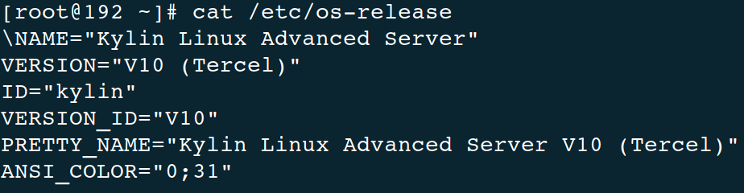
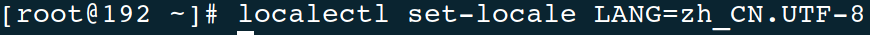
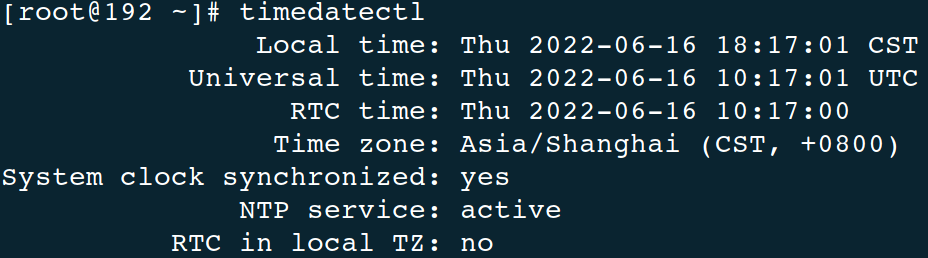
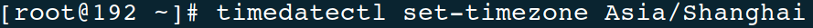
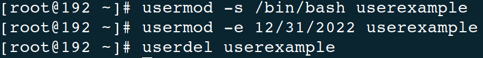
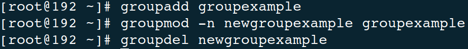
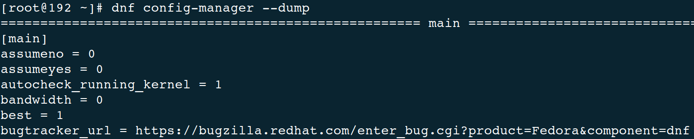
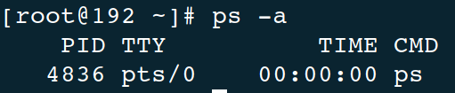

# 麒麟软件实训答辩

## 1 Linux基础知识

### 1.1 查看系统信息

`cat /etc/os-release`



- 查看 CPU 信息：`lscpu`

	

- 查看内存信息：`free`

	

- 查看磁盘信息：`fdisk -l`

	

- 查看系统资源实时信息：`top`

	

### 1.2 基础配置

- 设置语言环境、设置键盘：`localectl`

	

	

	

	

	

- 设置日期和时间：`timedatectl`、`date`、`hwclock`

	

	

	

	

	

### 1.3 管理用户和用户组

- 管理用户：`useradd`、`usermod`、`userdel`

	

	

- 管理用户组：`groupadd`、`groupmod`、`groupdel`、`gpasswd`、`newgrp`

	

### 1.4 使用 DNF 管理软件包

- 配置 DNF（main 和 repository）
- 创建本地软件源仓库：`dnf install createrepo`、`createrepo --database /mnt/local_repo`
- 添加、启用和禁用软件源：`dnf config-manager`
- 管理软件包：（`dnf` 后加）搜索 `search`、列出 `list`、信息 `info`、安装 `install`、下载 `download`、删除 `remove`
- 管理软件包组：（`dnf group` 后加）列出 `list`、信息 `info`、安装 `install`、删除 `remove`
- 检查并更新：`dnf check-update`、`dnf update`



### 1.5 管理服务

管理系统服务、改变运行级别、关闭、暂停和休眠系统


### 1.6 管理进程

查看进程（`who`、`ps`、`top`、`kill`）、调度启动进程、挂起 / 恢复进程




## 2 网络知识

### 2.1 OSI 7 层模型

- 物理层：通信介质的信号到数字信号
- 数据链接层：局域网之间计算机通信
- 网络层：IP 地址、路由
- 传输层：TCP 协议、UDP 协议、端口
- 会话层：控制发包的数据，会话层控制传输层三次握手
- 表示层：文件格式
- 应用层：应用程序使用

### 2.2 TCP、IP 协议

- 物理层、数据链接层、网络层、传输层、应用层
- 源 mac 地址和目标 mac 地址、源 IP 地址和目标 IP 地址、源端口和目标端口

### 2.3 ARP 协议和 VLAN

- Address Resolution Protocol，地址解析协议：把 IP 地址解析成 mac 地址
- 先发广播，再回应
- ARP 欺骗、广播风暴

### 2.4 tcpdump 抓包

- `-i` 指定网卡
- 默认抓 tcp，可以通过 `udp` 指定监听 udp、`icmp` 指定抓 ping 包
- `port` 指定端口（http 80、ftp 21、ssh 22、telnet 23、smtp 25、dns udp 53、ntp udp 123）
- `-n` 不把 ip 解析成域名
- `-nn` 不把端口解析成协议
- `-c` 指定抓包的数量
- `-w` 保存抓取的数据包
- `-S` 不把 seq 解析成相对值
- `or` 抓取多个端口

### 2.5 常用的网络命令

- 改网卡配置文件：

```text
TYPE="Ethernet" #网络类型为以太网
BOOTPROTO="static" #获取ip的方式dhcp，手动
NAME="eth0" #网卡名称（可省略）
DEVICE="eth0" #设备名称
ONBOOT="yes" #开机启动网络连接
IPADDR="192.168.11.88" #ip地址
NETMASK="255.255.255.0" #子网掩码，也可以写成 PREFIX=24
GATEWAY="192.168.1.1" #网关，唯一的出口，多网卡只配置1个网关
DNS1="223.5.5.5"
DNS2="223.6.6.6"
```

- `nc`：

	- `nc -u localhost 8080` 客户端，使用 udp 向 8080 端口发送数据
	- `nc -u -l 8080` 服务端，监听 8080 端口的 udp

- `nmap`：扫描端口

	- 默认快速扫描（扫描常用端口）
	- `-p` 指定扫描端口范围，如 `-p1-5000`

- `telnet <ip> <port>`： 连接服务器，远程登录

- `iftop` 监控外部 ip 地址的流量

- `traceroute` 追踪路由

### 2.6 静态路由

- 查看路由表：`route -n`
- 添加静态路由：`route add -net 172.16.0.0/24 gw 10.0.0.12`
- 启用内核转换参数：`sysctl net.ipv4.ip_forward=1`
- 重启网络服务需要重新配置静态路由，永久保存需要修改配置文件
- 静态路由持久化存储，需要添加 `/etc/sysconfig/network-scripts/route-eth0`
- 内核转换参数持久化存储，需要在 `/etc/sysctl.conf` 添加一行，并 `sysctl -p` 生效
- `route add -net 0.0.0.0/0 gw 10.0.0.12`：去任意网段，通过网关
- 默认网关是优先级最低的静态路由
- 动态路由：相互学习，动态更新路由表

### 2.7 iptables 实现 nat 上网

- iptables 调用内核 `netfilter` 模块实现数据包过滤
- iptables 和 firewalld 的区别：
	- firewalld 有 gui 和 cli，iptables 只有 cli
	- firewalld 服务实现自动加载和保存
- iptables 的五链：
	- PREROUTING：数据包进来之前的处理，到 INPUT 或 FORWARD
	- INPUT：过滤进来的数据包，完成后给应用程序，应用程序给 OUTPUT
	- FORWARD：数据包从 PREROUTING 过来转发，到 POSTROUTING
	- OUTPUT：过滤出去的数据包，完成后给 POSTROUTING
	- POSTROUTING：数据包出去时的处理
- iptables 的四表：
	- filter 表，过滤：包含 INPUT、FORWARD、OUTPUT
	- nat 表，地址转换：包含 PREROUTING、INPUT、OUTPUT、POSTROUTING
	- mangle 表，修改数据包的信息，如 ttl 等
	- raw 表，追踪数据包，traceroute


- `iptables -t <表名> -L -n`
- `iptables -P FORWARD DROP` 更改 FORWARD 策略为 DROP
- `iptables -F` 清空规则
- 使用 iptables 实现 nat 上网的条件：
	- network02 能上外网、有 2 个网卡
	- network03 使用 network02 的内网 ip 做网关
	- network02 配置内核转发参数 `net.ipv4.ip_forward=1`
	- network02 添加 nat 转换规则：`iptables -t nat -A POSTROUTING -s 172.16.0.0/24 -j MASQUERADE`

### 2.8 把 Linux 配置成路由器

- Linux 服务器添加 DHCP 功能：安装 dhcp 包、修改  `/etc/dhcp/dhcpd.conf`

	- `d` 代表守护进程，`dhcp6.conf` 代表 ipv6

```text
subnet 192.168.0.0 netmask 255.255.255.0 { #网络号和子网掩码
  range 192.168.0.26 192.168.0.200; #ip地址分配范围
  option domain-name-servers 180.76.76.76; #指定给客户端分配的dns地址
  option routers 192.168.0.12; #指定给客户端分配的网关ip
  option broadcast-address 192.168.0.255; #指定广播地址
  default-lease-time 600; #dhcp默认租约时间
  max-lease-time 7200; #dhcp最长租约时间
}
```

- 启动服务：`systemctl start dhcpd`（dhcp 是 udp 协议，67 端口）
- 以上服务端配置完成。客户端把手动获取 ip 地址改为 dhcp：`BOOTPROTO=DHCP`，并删除 ip 地址和子网掩码，重启网络服务
- `ip addr` 查看 ip、`route -n` 查看网关、`cat /etc/resolv.conf` 查看 dns
- 每经过一次 nat 转换，ttl 值减 1

## 3 虚拟网络安装配置

### 3.1 部署前的准备

挂载本地镜像源，安装以下 rpm 包：`python3-openstackclient`、`mariadb`、`mariadb-server`、`python3-PyMySQL`、`rabbitmq-server`、`memcached`、`python3-memcached`、`openstack-keystone`、`httpd`、`python3-mod_wsgi`、`openstack-neutron`、`openstack-neutron-ml2`、`openstack-neutron-openvswitch`、`ebtables`、`ipset`。

### 3.2 Neutron 的脚本部署

1. 定义 IP 和主机名变量，后续部署使用

2. 设置语言为中文、编码为 `UTF-8`

3. 利用 `firewalld` 开放端口，更新防火墙规则

4. 配置 MySQL，启动 `mariadb.service`

5. 启动 `rabbitmqp-server`，增加新用户名和密码，给用户赋予配置、读、写权限

	> 此处发生错误，在 `/etc/rabbitmq/rabbitmq-env.conf` 文件中添加 `NODENAME=rabbit@localhost`，重启 `rabbitmq-server` 解决。

6. 将 `memcached` 监听地址改为所有 IP，启动服务

7. MySQL 创建 `keystone` 和 `neutron` 数据库

8. 更新 `keystone` 配置文件，设置文件所有权，设置管理 IP，初始化数据库信息和 `Fernet` 密钥数据库，并设置密码和节点

9. 设置管理 IP，配置 HTTP 配置文件，启动服务

10. 配置用户名、密码、项目名等信息

11. 获取 openstack token 并创建 service 项目

12. 创建 neutron 用户，将 neutron 用户添加入 service 项目并拥有 admin 权限，创建 network 服务并添加三个 endpoint

13. 更新 neutron 配置文件，设置文件所有权和管理 IP

14. 更新 ml2 配置文件和所有权

15. 更新 openvswitch_agent 配置文件、所有权、业务 IP

16. 更新 l3_agent 配置文件和所有权

17. 更新 dhcp_agent 配置文件和所有权，杀死 dnsmasq 进程

18. 更新 ml2_conf 配置文件，同步数据库

19. 启动 neutron 服务

### 3.3 验证网络操作

使用 `openstack network agent list` 命令列出代理以验证启动 neutron 代理是否成功，得到输出如下：


启动成功。

### 3.4 Neutron 创建网络和子网

使用 `neutron net-create net1` 命令创建名为 `net1` 的网络：


使用 `neutron subnet-create net1 192.168.2.0/24 --name subnet1` 命令创建名为 `subnet1`、IP 为 `192.168.0.2/24` 的子网：


查看创建结果：


## 4 深入理解 Neutron - Openstack 网络实现

### 4.1 OpenStack 网络实现方式对比

- **gre**：跨不同网络实现二次 IP 通信，L3 上面包装 L3，封装在 IP 报文中，点对点隧道，不用变更底层网络架构重建 L2、L3 通信，实现不同 host 之间网络 guest 互通，方便 guest 迁移，支持网络数量扩大。

- **vlan**：vlan 将局域网设备从逻辑上划分成一个个网段，从而实现虚拟工作组的数据交换技术。分隔了端口，即便在同一个交换机上，处于不同 VLAN 的端口也是不能通信的。这样一个物理的交换机可以当作多个逻辑的交换机使用；使网络更加安全，不同 VLAN 不能直接通信，杜绝了广播信息的不安全性，且便于灵活管理。

- **vxlan**：vxlan 将虚拟机发出的数据包封装在 UDP 中，并使用物理网络的 IP/MAC 作为 outer-header 进行封装，然后在物理 IP 网上传输，到达目的地后由隧道终结点解封并将数据发送给目标虚拟机。解决了 vlan 的数量和物理网络基础设施的限制，避免了 TOR 交换机 MAC 表耗尽，满足了多租户场景。

### 4.2 DVR 对不同流量的区分

为了降低网络节点的负载，同时提高可扩展性，OpenStack 自 Juno 版本开始正式引入了分布式路由（Distributed Virtual Router，DVR）特性（用户可以选择使用与否），来让计算节点自己来处理原先的大量东西向流量和非 SNAT 南北流量（有 floating IP 的 vm 跟外面的通信）。

这样网络节点只需要处理占到一部分的 SNAT （无 floating IP 的 vm 跟外面的通信）流量，大大降低了负载和整个系统对网络节点的依赖。很自然的，FWaaS 也可以跟着放到计算节点上。

典型场景：从网络的访问看，涉及到路由服务的至少是需要跨子网的访问，又包括是否是同一机器、是否是涉及到外网（东西向 vs 南北向）。DVR根据如下特征区分不同流量。

| 方向 | 同一机器                      | 不同机器           |
| ---- | ----------------------------- | ------------------ |
| 东西 | 本地网桥处理                  | 本地东西路由器     |
| 南北 | 本地南北路由器  floating 转发 | 网络节点 SNAT 转发 |

### 4.3 OpenStack 中网络节点和计算节点的不同作用

- 网络节点：网络节点有且仅有 Neutron 服务，就是网络服务。Neutron 主要负责管理私有网段和公有网段之间的通信，同时管理虚拟机网络之间的通信以及防火墙等等。一般在部署时会部署两个以上的网络端口，分别用于与控制节点通信、同计算/存储节点通信、用于外部的虚拟机与相应的网络之间的通信。
- 计算节点：计算节点主要包含计算服务、网络服务以及监控服务。计算节点对所部署的虚拟机提供基本的网络功能支持，包括隔离不同租户的虚拟机和进行一些基本的安全策略管理。计算节点包含 Nova，Neutron，Telemeter 三个服务：
	- 基础服务 Nova：提供虚拟机的创建，运行，迁移，快照等各种围绕虚拟机的服务，并提供 API 与控制节点对接，由控制节点下发任务
	- 基础服务 Neutron：提供计算节点与网络节点之间的通信服务
	- 扩展服务 Telmeter：提供计算节点的监控代理，将虚拟机的情况反馈给控制节点，是 Centimeter 的代理服务

### 4.4 HAProxy 如何实现负载均衡策略

HAProxy 提供高可用性、负载均衡以及基于 TCP 和 HTTP 应用的代理，根据运行模式可以很简单安全的整合到当前的架构中，同时可以保护web服务器不被暴露到网络上。HAProxy 应用在七层架构中，较为灵活，支持 SSL。

Neutron 支持的负载均衡算法包括：轮询、最少连接、源 IP。

- 轮询 Round robin，是最普遍的算法，每当有一个新的请求来临，负载均衡器都会按顺序选择服务器池中的一台设备来响应。有点类似音乐播放软件的列表循环。这种模式下服务器池中的每一个服务器都能均匀地分配到相同的访问请求数，而不会管服务器繁忙程度、服务器配置的高低。比较适用于服务器池内的服务器配置相同、用户访问习惯相同的业务。加权轮询是改进的负载均衡算法，当后端服务器池中设备配置高低不一时，可根据服务器处理能力的高低分配服务器的权值，权值高的服务器会被分配更多的用户请求。
- 最少连接算法 Least connections，负载均衡器收到新的请求时，都会从当前服务器池中挑选一个当前并发连接数最少的服务器来负责。最少连接算法考虑的服务器的实时负载情况，尽量保证了任务分配的平均，防止单个服务器超出负载，但是当后端服务器池中存在高处理能力的服务器时，这个处理能力高的设备始终无法获得更多的工作负载，存在性能的浪费。最少连接算法有优化后的加权最小连接算法。
- IP hash，负载均衡器在收到主机的连接请求后，会根据数据包的源IP地址字段的hash值，同时按照轮询的方式为客户端分配主机，当负载均衡器再次收到同一IP的请求时，则会按照之前的记录为客户端分配上次建立连接的主机。这样保证了当同一个IP的用户，多次独立的访问都能由同一台服务器来处理，适用于服务器需要临时记录或保存客户信息的应用中。

